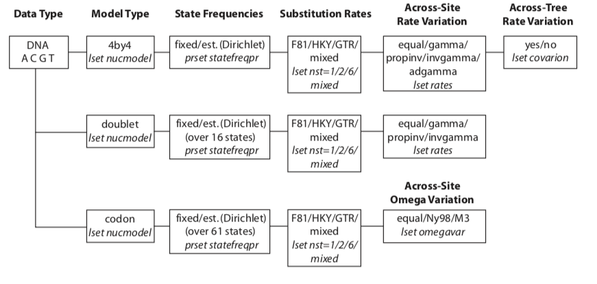

Notes for command line MrBayes

**Useful resources**
- [Manual v3.2](http://mrbayes.sourceforge.net/mb3.2_manual.pdf)
- [Tutorial](http://mrbayes.sourceforge.net/wiki/index.php?title=Tutorial&oldid=5239)
- [John P. Huelsenbeck and Fredrik Ronquist, Bayesian Analysis of Molecular Evolution
Using MrBayes](http://people.binf.ku.dk/rasmus/courses/Spring06/Chapter7-MrBayes.pdf)


### Step 1 - Convert your sequence file to nexus format
You will need to convert your aligned sequence file to a nexus file first.
Although this can commonly be done in most sequence analysis programs (e.g. geneious) using the `export as...` make sure you check the file formatting by opening the `nexus` file in a text editor program (e.g. atom).

I find a more reliable way is to use a web program to convert the fasta file to a nexus file - such as one available [here](http://sequenceconversion.bugaco.com/converter/biology/sequences/fasta_to_nexus.php).
Make sure the sequence names do not contain any of the following; hyphens `-`, commas`,`, semicolcons `:`, exclamation marks `!`.
Underscores `_` and periods `.` are okay.

> For details on how to download MrBayes see the [manual section 1.2](http://mrbayes.sourceforge.net/mb3.2_manual.pdf)


### Step 2 - Activate MrBayes

Type `mb` to activate MrBayes

```
execute AlignedSeqs.nexus
```

This will check will ensure your data is formatting and read correctly by the program. Any issues at this point are most likely due to the syntax and formatting of your nexus file.
Note: you may need to also include the path to the file if you are not already in the correct directory.
Generic Shell commands (e.g. `ls` `cd`) do not work in the MrBayes environment.

### Step 3 - Set the evolutionary model
This is where you start to set the parameters for your analysis. You will likely need to do some background work to figure out which is the correct model for your data - [see here](/Users/siobhonegan/Documents/Uni/PhD/code/notes-cheatsheets/Evolutionary_model_selection.md)

If your data are not DNA or RNA, if you want to invoke a different model, or if you want to use
non-default priors, refer to the MrBayes manual and Appendix for more help.



*DNA models support by MrBayes v3 (MrBayes Manual p164)*


**Settings**

| Parameter | Options                                          | Current setting |
| --------- |:------------------------------------------------:| ---------------:|
| Nucmodel  | 4by4/Doublet/Codon/Protein                       | 4by4            |
| Nst       | 1(JC/F81)/2(HKY)/6(GTR)/Mixed                    | 1               |
| Code      | Universal/Vertmt/Mycoplasma/Yeast/Ciliates/Metmt | Universal       |
| Ploidy    | Haploid/Dilpoid/Zlinked                          | Diploid         |
| Rates     | Equal/Gamma/Propinv/Invgamma/Adgamma             | Equal           |
| Ngammacat | number                                           | 4               |
| Nbetacat  | number                                           | 5               |
| Omegavar  | Equal/Ny93/M3                                    | Equal           |
| Covarion  | No/Yes                                           | No              |
| Coding    | All/Variable/Noabsencesites/Nopresencesites      | All             |
| Parsmodel | No/Yes                                           | No              |


To set a GTR + I + G model execute the following:
```
lset nst=6 rates=invgamma
```


### Step 4 start sampling
```
mcmc ngen=1000000 samplefreq=500 printfreq=500 diagnfreq=5000
```

If the standard deviation of split frequencies is below 0.01 the specific number of generations, stop the run by answering no when the program asks `Continue the analysis? (yes/no)`.
Otherwise, keep adding generations until the value falls below `0.01`. If you are interested mainly in the well-supported parts of the tree, a standard deviation below `0.05` may be adequate.

### Get output

Type `sump` to summarize the parameter values using the same burn-in as the diagnostics in the mcmc command. The program will output a table with summaries of the samples of the substitution model parameters, including the mean, mode, and 95 % credibility interval (region of Highest Posterior Density, HPD) of each parameter. Make sure that the potential scale reduction factor (PSRF) is reasonably close to 1.0 for all parameters; if not, you need to run the
analysis longer.

Summarize the trees using the same burn-in as the mcmc command by typing `sumt`. The program will output a cladogram with the posterior probabilities for each split and a phylogram with mean branch lengths. Both trees will also be printed to a file that can be read by FigTree and other tree-drawing programs, such as TreeView and Mesquite.

It does not have to be more complicated than this; however, as you get more proficient you will probably want to know more about what is happening behind the scenes. The rest of this section explains each of the steps in more detail and introduces you to all the implicit assumptions you are making and the machinery that MrBayes uses in order to perform your analysis.
