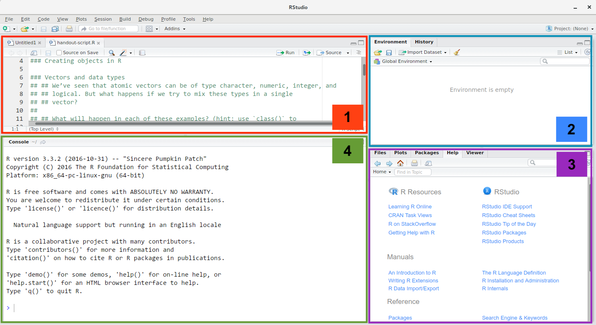

<i class="fab fa-r-project"></i> is a programming language that is especially powerful for data exploration, visualization, and statistical analysis. ["`R`"](http://www.r-project.org/) is also a software that interprets the scipts written using it. The most popular way to interact with R is by using [RStudio](http://www.rstudio.com/). To get started you need to install R and RStudio on your computer.

1. Source pane - for your scripts and document
2. Environment/history - lists all your variables loaded
3. Files/Plots/Helper etc - here you can navigate to find (and upload) files, this is where your plots will appear when you view them, and its also here any `?help` info will appear
4. Console - this is running document of what code you have executed.

Need further convincing to user R...[read on](https://datacarpentry.org/R-ecology-lesson/00-before-we-start.html)

***

## Install (& updates)

**Windows**

If you already have R and RStudio installed:

* Open RStudio, and click on “Help” > “Check for updates”. If a new version is available, quit RStudio, and download the latest version for RStudio.
* To check which version of R you are using, start RStudio and the first thing that appears in the console indicates the version of R you are running. Alternatively, you can type `sessionInfo()`, which will also display which version of R you are running. Go on the [CRAN website](https://cran.r-project.org/bin/windows/base/) and check whether a more recent version is available. If so, please download and install it. You can [check here](https://cran.r-project.org/bin/windows/base/rw-FAQ.html#How-do-I-UNinstall-R_003f) for more information on how to remove old versions from your system if you wish to do so.

If you don’t have R and RStudio installed:

* Download R from the [CRAN website](http://cran.r-project.org/bin/windows/base/release.htm.
* Run the `.exe` file that was just downloaded
* Go to the [RStudio download page](https://www.rstudio.com/products/rstudio/download/#download)
* Under *Installers* select **RStudio x.yy.zzz - Windows Vista/7/8/10** (where x, y, and z represent version numbers)
* Double click the file to install it
* Once it’s installed, open RStudio to make sure it works and you don’t get any error messages.

[Video Tutorial](https://www.youtube.com/watch?v=q0PjTAylwoU)

**MacOS**

If you already have R and RStudio installed:

* Open RStudio, and click on “Help” > “Check for updates”. If a new version is available, quit RStudio, and download the latest version for RStudio.
* To check the version of R you are using, start RStudio and the first thing that appears on the terminal indicates the version of R you are running. Alternatively, you can type `sessionInfo()`, which will also display which version of R you are running. Go on the [CRAN website](https://cran.r-project.org/bin/macosx/) and check whether a more recent version is available. If so, please download and install it.

If you don’t have R and RStudio installed:

* Download R from the [CRAN website](http://cran.r-project.org/bin/macosx/).
* Select the `.pkg` file for the latest R version
* Double click on the downloaded file to install R
* It is also a good idea to install [XQuartz](https://www.xquartz.org/) (needed by some packages)
* Go to the [RStudio download page](https://www.rstudio.com/products/rstudio/download/#download)
* Under Installers select **RStudio x.yy.zzz - Mac OS X 10.6+ (64-bit)** (where x, y, and z represent version numbers)
* Double click the file to install RStudio
* Once it’s installed, open RStudio to make sure it works and you don’t get any error messages

[Video Tutorial](https://www.youtube.com/watch?v=5-ly3kyxwEg)

## Welcome to `R`!

R is much more than statistics, and making graphs, it is a never-ending tool that is constantly being updated. Before we know it R will be able to cook your dinner and go to the shops too! But for now check out its great range of features for project management. It can talk all types of coding languages, and is useful to keep track of exactly what you are doing. You can even make your own webpage to help keep track of all that code and information, just like I am doing here!

Some links to get you started:

- [R markdown](https://rmarkdown.rstudio.com/lesson-1.html)
- [R shiny](https://shiny.rstudio.com/)
- [R project for statistical computing](https://www.r-project.org/)
- [Project management with RStudio](https://swcarpentry.github.io/r-novice-gapminder/02-project-intro/)
- [R bookdown](https://bookdown.org/)

## An extra note

As a general rule these pages on RStudio are not meant as a stand alone tutorial/workflow to learn coding. 
Generally they includes lots of links to people who have done the hard work, and I just have a small subset of code that is relevant to my workflow or some common code chunks I use.
So please read on with caution - mostly this is just a place for me to collate *some* websites/tutorials/information that I have found useful during my research in one central location.

